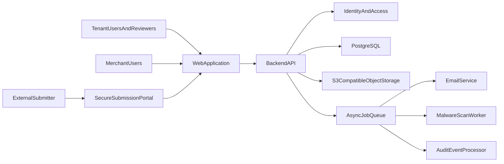
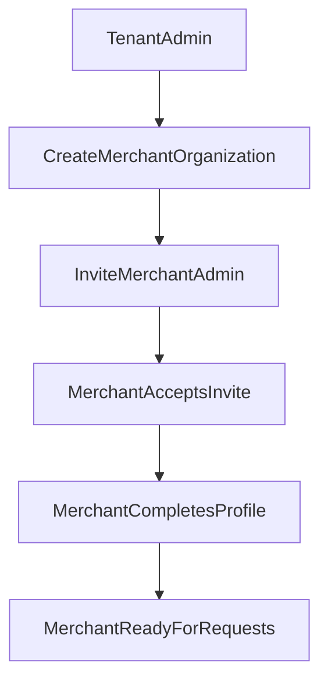
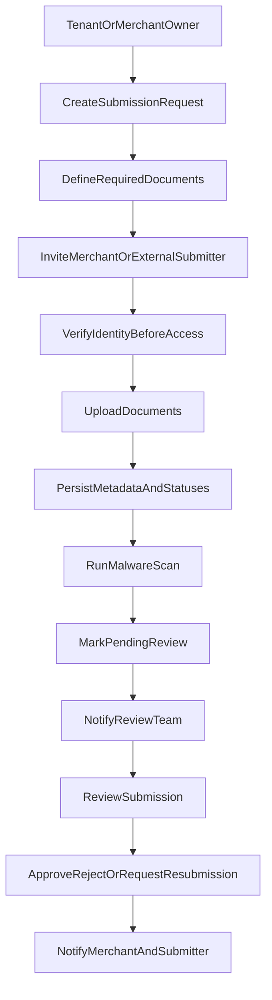

# Trade Finance KYC Platform - Architecture

**Version:** 1.0  
**Date:** July 2026  
**Scope:** Multi-tenant web platform for merchant onboarding, KYC collection, and trade-document submission

---

## 1. Executive Summary

This platform is a secure, web-first system for trade finance companies that need to collect and review KYC and transaction-supporting documents such as:
- company incorporation documents
- KRA and tax certificates
- bank statements
- letters of credit
- proforma invoices
- contracts, shipping documents, and related files

Each trade finance company operates as an independent tenant with its own users, merchants, review queue, notifications, and document records. The MVP should prioritize fast onboarding, secure uploads, simple status tracking, and manual review, while leaving room for stronger compliance and more automation later.

---

## 2. Business Objectives

The platform should help tenants:
- reduce email-based back-and-forth for document collection
- shorten the time from finance request to review readiness
- maintain secure, auditable handling of sensitive documents
- support multiple merchants and external counterparties without mixing data
- scale to multiple trade finance companies on shared infrastructure

---

## 3. Actors and Access Boundaries

### 3.1 Core Actors

| Actor | Description | Key Actions |
|------|-------------|-------------|
| `tenant_admin` | Operations or risk lead inside a trade finance company | Configure tenant, onboard merchants, create requests, assign reviewers, view all submissions |
| `reviewer` | Internal reviewer or credit/risk analyst | Review pending submissions, add comments, approve, reject, request resubmission |
| `merchant_admin` | Merchant lead user | Manage merchant users, create or track requests, upload merchant-owned documents |
| `merchant_user` | Merchant team member | Upload documents, view request status, respond to resubmission requests |
| `external_submitter` | Invited counterparty or client contact | Access a limited secure submission journey and upload only for the specific request |

### 3.2 Submission Ownership Rules

- A `tenant_admin` may create a submission request for a merchant.
- A `merchant_admin` may create a submission request only if the tenant policy allows self-service initiation.
- A request belongs to one `tenant` and one primary `merchant organization`.
- A request may optionally target an `external counterparty organization`.
- An `external_submitter` can only access the specific request they were invited to complete.
- Reviewers cannot see data outside their tenant, even if infrastructure is shared.

---

## 4. High-Level Architecture

### 4.1 Component Responsibilities

| Component | Responsibility |
|----------|----------------|
| `WebApplication` | Authenticated tenant and merchant UI, plus secure external submission flow |
| `BackendAPI` | Auth, tenancy enforcement, workflow rules, metadata persistence, notifications |
| `PostgreSQL` | Users, organizations, requests, review decisions, audit events, notification records |
| `ObjectStorage` | Document binary storage using tenant-scoped prefixes |
| `AsyncJobQueue` | Email delivery, scan processing, reminder jobs, event fan-out |
| `IdentityAndAccess` | Login, invitations, session management, role checks, MFA support |

---

## 5. Multi-Tenancy Model

### 5.1 Recommended MVP Approach

Use a shared application and shared database with strict logical isolation:
- all tenant-owned records include `tenant_id`
- tenant scoping is enforced in repositories or ORM middleware
- storage keys include tenant context
- notification and audit queries are tenant-filtered
- role checks happen inside a tenant boundary

### 5.2 Why This Model

This approach gives:
- faster delivery than dedicated infrastructure per tenant
- lower operating cost in the early stage
- a clean path to move premium or regulated tenants to isolated infrastructure later

### 5.3 Isolation Boundaries

| Layer | Isolation Mechanism |
|------|---------------------|
| Application | Tenant-aware authorization and query filters |
| Database | `tenant_id` on domain tables, plus row-level security if adopted |
| Storage | `tenant/{tenantId}/request/{requestId}/document/{documentId}` prefixes |
| Audit | Tenant-scoped event partitions or indexed filters |
| Notifications | Tenant-aware templates, recipients, and event streams |

---

## 6. Core Product Workflows

### 6.1 Merchant Onboarding

### 6.2 Submission Request Flow

### 6.3 Reviewer Queue

The reviewer dashboard should provide:
- pending review
- recently submitted
- needs resubmission
- approved
- rejected
- overdue or stale requests

---

## 7. State Model

### 7.1 Submission Request States

| State | Meaning |
|------|---------|
| `draft` | Request created but not yet shared |
| `link_sent` | Secure access link sent to submitter |
| `in_progress` | Submitter started but has not submitted all required items |
| `submitted` | Submitter finalized the package |
| `pending_review` | Package is reviewable by tenant staff |
| `approved` | Review completed successfully |
| `rejected` | Submission rejected and closed |
| `needs_resubmission` | Missing or invalid documents need replacement |
| `archived` | Closed request retained for recordkeeping |

### 7.2 Document-Level States

| State | Meaning |
|------|---------|
| `requested` | Document required but not yet uploaded |
| `uploaded` | File uploaded but not yet submitted |
| `scanning` | File awaiting malware scan |
| `ready` | File passed checks and is reviewable |
| `rejected` | File was rejected by reviewer |
| `replaced` | A newer upload superseded the file |

---

## 8. Notification Model

The MVP should support:
- email notifications for invites, submission receipt, review outcome, and resubmission requests
- in-app notifications for tenant and merchant users
- event-triggered notifications from workflow transitions

Key notification events:
- merchant invited
- external submitter invited
- submission started
- submission completed
- submission pending review
- approval issued
- rejection issued
- resubmission requested

---

## 9. Recommended Technology Direction

### 9.1 Suggested Stack

| Layer | Recommendation | Why |
|------|----------------|-----|
| Frontend | `Next.js` | Strong for authenticated apps and secure server-side flows |
| Backend | `NestJS` | Structured modules, clean DTOs, guards, queues, and enterprise patterns |
| Database | `PostgreSQL` | Strong relational model, indexing, JSON support, row-level security option |
| Object Storage | `AWS S3` | Standard cloud storage with signed URL support and KMS integration |
| Queue | `SQS` or `BullMQ` | Handles asynchronous notifications, scans, and reminders |
| Auth | `Auth0` or `AWS Cognito` | Faster secure setup with support for MFA, invites, and enterprise hardening |
| Infrastructure | Containers plus IaC | Easier promotion across staging and production |

### 9.2 Backend Module Sketch

The backend should be split into modules such as:
- `auth`
- `tenants`
- `organizations`
- `users`
- `submission_requests`
- `documents`
- `reviews`
- `notifications`
- `audit`
- `storage`

---

## 10. Scaling Strategy

### 10.1 MVP to Growth

Start with:
- shared app
- shared database
- shared queue
- shared object storage bucket with tenant prefixes

Scale later with:
- dedicated bucket or KMS keys per premium tenant
- dedicated database per premium tenant
- regional storage policies if regulations require them
- OCR, classification, and sanctions screening services

### 10.2 Non-Functional Targets

The system should be designed for:
- resumable uploads
- stable signed upload flows
- horizontal scaling of stateless API nodes
- async processing for scan and notification steps
- indexed filtering for tenant reviewer dashboards

---

## 11. UX Recommendations

The UX should optimize for speed and trust:
- checklist-driven document requests
- clear examples for each required document
- save-and-return flows
- upload progress indicators
- visible submission receipt after completion
- reviewer comments attached to specific missing or rejected items

For external submitters, keep the journey narrow:
- access only one request
- minimal navigation
- clear security messaging
- one obvious next action

---

## 12. Architecture Decisions To Keep Stable

The following should remain stable even if frameworks change:
- tenant-first data model
- object storage for files
- stateless backend APIs
- asynchronous notification and scan processing
- auditability of every workflow transition
- explicit request and document state machines
