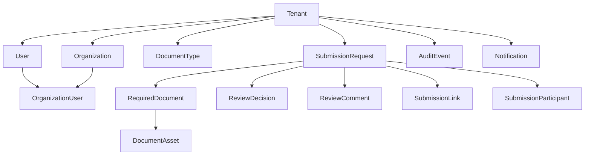
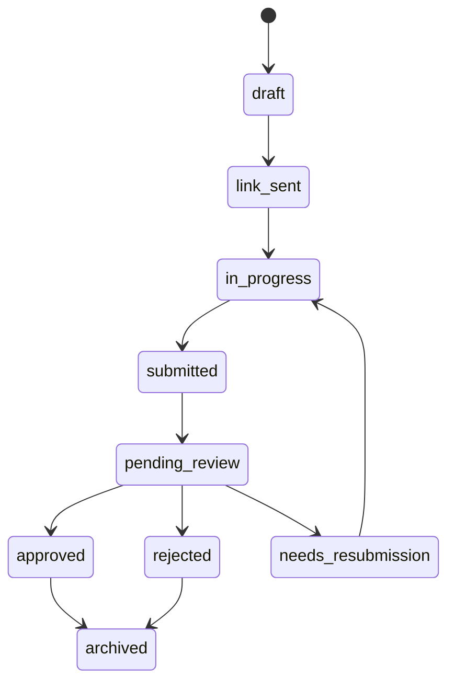

# Trade Finance KYC Platform - Data Model

**Version:** 1.0  
**Date:** July 2026

---

## 1. Modeling Principles

The data model should preserve:
- strict tenant ownership
- clean separation between organizations, users, requests, and documents
- full auditability of sensitive actions
- support for both merchant-owned and externally submitted documents
- extensibility for future workflows such as expiry reminders, maker-checker review, and compliance integrations

---

## 2. Core Entities

### 2.1 Tenant and Organization Layer

| Entity | Purpose | Key Fields |
|-------|---------|-----------|
| `tenants` | Trade finance companies using the platform | `id`, `name`, `slug`, `status`, `branding_config`, `created_at` |
| `organizations` | Merchant or counterparty businesses inside a tenant | `id`, `tenant_id`, `type`, `legal_name`, `registration_number`, `country`, `status` |
| `users` | Human actors tied to a tenant | `id`, `tenant_id`, `email`, `full_name`, `status`, `last_login_at` |
| `organization_users` | Many-to-many link between users and organizations | `id`, `organization_id`, `user_id`, `role`, `created_at` |

Recommended organization `type` values:
- `merchant`
- `counterparty`
- `borrower`
- `supplier`

### 2.2 Workflow Layer

| Entity | Purpose | Key Fields |
|-------|---------|-----------|
| `submission_requests` | Top-level workflow item for a document package | `id`, `tenant_id`, `merchant_organization_id`, `counterparty_organization_id`, `created_by_user_id`, `status`, `request_type`, `submitted_at` |
| `required_documents` | Checklist entries required for a request | `id`, `submission_request_id`, `document_type_id`, `label`, `is_required`, `sequence`, `status` |
| `document_types` | Reusable catalog of document categories | `id`, `tenant_id`, `code`, `name`, `group`, `description`, `is_active` |
| `document_assets` | Uploaded file metadata and storage reference | `id`, `tenant_id`, `submission_request_id`, `required_document_id`, `uploaded_by_user_id`, `storage_key`, `file_name`, `mime_type`, `size_bytes`, `checksum`, `status` |
| `review_decisions` | Review outcome records | `id`, `tenant_id`, `submission_request_id`, `reviewer_user_id`, `decision`, `summary_comment`, `created_at` |
| `review_comments` | Granular comments on request or file items | `id`, `tenant_id`, `submission_request_id`, `document_asset_id`, `reviewer_user_id`, `comment`, `created_at` |

### 2.3 Access and Delivery Layer

| Entity | Purpose | Key Fields |
|-------|---------|-----------|
| `submission_participants` | Who is allowed to act on a request | `id`, `submission_request_id`, `user_id`, `participant_type`, `access_level` |
| `submission_links` | Secure invitation records for external access | `id`, `tenant_id`, `submission_request_id`, `email`, `token_hash`, `expires_at`, `used_at`, `status` |
| `notifications` | Email and in-app delivery records | `id`, `tenant_id`, `user_id`, `channel`, `event_type`, `status`, `sent_at` |
| `audit_events` | Append-only security and workflow log | `id`, `tenant_id`, `actor_user_id`, `actor_type`, `event_type`, `resource_type`, `resource_id`, `metadata`, `occurred_at` |

---

## 3. Relationship Overview



---

## 4. Suggested Table Sketch

### 4.1 `tenants`

| Column | Type | Notes |
|--------|------|-------|
| `id` | UUID | Primary key |
| `name` | text | Display name |
| `slug` | text | Unique tenant identifier |
| `status` | text | `active`, `suspended`, `pending_setup` |
| `branding_config` | jsonb | Optional logos, colors, sender names |
| `created_at` | timestamptz | Audit |
| `updated_at` | timestamptz | Audit |

### 4.2 `organizations`

| Column | Type | Notes |
|--------|------|-------|
| `id` | UUID | Primary key |
| `tenant_id` | UUID | FK to `tenants` |
| `type` | text | Merchant or related party category |
| `legal_name` | text | Registered business name |
| `registration_number` | text | Company or incorporation identifier |
| `tax_identifier` | text | Optional KRA or tax number |
| `country` | text | ISO country code |
| `status` | text | `active`, `inactive`, `pending_verification` |
| `created_at` | timestamptz | Audit |
| `updated_at` | timestamptz | Audit |

### 4.3 `users`

| Column | Type | Notes |
|--------|------|-------|
| `id` | UUID | Primary key |
| `tenant_id` | UUID | FK to `tenants` |
| `email` | citext | Unique per tenant or globally, based on auth strategy |
| `full_name` | text | Display name |
| `status` | text | `invited`, `active`, `disabled` |
| `last_login_at` | timestamptz | Security visibility |
| `created_at` | timestamptz | Audit |
| `updated_at` | timestamptz | Audit |

### 4.4 `submission_requests`

| Column | Type | Notes |
|--------|------|-------|
| `id` | UUID | Primary key |
| `tenant_id` | UUID | FK to `tenants` |
| `merchant_organization_id` | UUID | Primary merchant |
| `counterparty_organization_id` | UUID | Optional supplier or client |
| `created_by_user_id` | UUID | Request originator |
| `request_type` | text | `kyc_onboarding`, `trade_transaction`, `facility_refresh` |
| `reference_code` | text | Human-readable identifier |
| `status` | text | State machine field |
| `submitted_at` | timestamptz | Final submission time |
| `review_due_at` | timestamptz | Optional SLA support |
| `created_at` | timestamptz | Audit |
| `updated_at` | timestamptz | Audit |

### 4.5 `required_documents`

| Column | Type | Notes |
|--------|------|-------|
| `id` | UUID | Primary key |
| `submission_request_id` | UUID | FK to request |
| `document_type_id` | UUID | FK to reusable type |
| `label` | text | UI label at request time |
| `description` | text | Upload instructions |
| `is_required` | boolean | Optional or mandatory |
| `sequence` | integer | Display order |
| `status` | text | `requested`, `uploaded`, `ready`, `rejected`, `waived` |
| `created_at` | timestamptz | Audit |
| `updated_at` | timestamptz | Audit |

### 4.6 `document_assets`

| Column | Type | Notes |
|--------|------|-------|
| `id` | UUID | Primary key |
| `tenant_id` | UUID | FK to `tenants` |
| `submission_request_id` | UUID | FK to request |
| `required_document_id` | UUID | FK to checklist item |
| `uploaded_by_user_id` | UUID | Nullable for pure external token flow |
| `storage_key` | text | S3 object key |
| `file_name` | text | Original filename |
| `mime_type` | text | File format |
| `size_bytes` | bigint | File size |
| `checksum` | text | Integrity verification |
| `scan_status` | text | `pending`, `clean`, `infected`, `failed` |
| `status` | text | `uploaded`, `scanning`, `ready`, `rejected`, `replaced` |
| `uploaded_at` | timestamptz | Upload timestamp |
| `created_at` | timestamptz | Audit |
| `updated_at` | timestamptz | Audit |

### 4.7 `review_decisions`

| Column | Type | Notes |
|--------|------|-------|
| `id` | UUID | Primary key |
| `tenant_id` | UUID | FK to `tenants` |
| `submission_request_id` | UUID | FK to request |
| `reviewer_user_id` | UUID | Internal actor |
| `decision` | text | `approved`, `rejected`, `needs_resubmission` |
| `summary_comment` | text | Outcome note |
| `created_at` | timestamptz | Audit |

### 4.8 `submission_links`

| Column | Type | Notes |
|--------|------|-------|
| `id` | UUID | Primary key |
| `tenant_id` | UUID | FK to `tenants` |
| `submission_request_id` | UUID | FK to request |
| `email` | text | Invitee address |
| `token_hash` | text | Never store raw token |
| `expires_at` | timestamptz | Time-bounded access |
| `used_at` | timestamptz | Optional consumption tracking |
| `status` | text | `active`, `expired`, `revoked`, `used` |
| `created_at` | timestamptz | Audit |

### 4.9 `audit_events`

| Column | Type | Notes |
|--------|------|-------|
| `id` | UUID | Primary key |
| `tenant_id` | UUID | FK to `tenants` |
| `actor_user_id` | UUID | Nullable when actor is token-based external party |
| `actor_type` | text | `internal_user`, `merchant_user`, `external_submitter`, `system` |
| `event_type` | text | Login, invite, upload, review, download, status change |
| `resource_type` | text | Entity type |
| `resource_id` | UUID | Target entity |
| `metadata` | jsonb | Safe structured event payload |
| `occurred_at` | timestamptz | Event timestamp |

---

## 5. Permission Model

### 5.1 Tenant Roles

| Role | Scope |
|------|-------|
| `tenant_admin` | Full tenant visibility and settings |
| `reviewer` | Review queue and submission decisions only |
| `merchant_admin` | Merchant-scoped management and submissions |
| `merchant_user` | Merchant-scoped upload and tracking |
| `external_submitter` | Request-scoped upload access only |

### 5.2 Request Access Rules

- A user may only see a request if they belong to the same tenant.
- A merchant user may only see requests tied to their organization.
- An external submitter may only access the request referenced by their active token or magic link.
- Reviewers may comment and decide, but not impersonate submitters.
- Tenant admins may override and archive requests when necessary.

---

## 6. Document Taxonomy

The platform should separate reusable types from request-time checklist items.

### 6.1 Suggested Groups

| Group | Example Types |
|------|----------------|
| `merchant_kyc` | Certificate of incorporation, tax certificate, shareholder register, bank statements |
| `counterparty_kyc` | Supplier registration, IDs, licenses |
| `trade_documents` | Proforma invoice, LC, purchase order, contract |
| `shipping_documents` | Bill of lading, packing list, insurance certificate |
| `compliance_supporting` | Sanctions declarations, beneficial ownership forms |

This lets each tenant create its own templates while still reusing a clean master model.

---

## 7. Submission Lifecycle Mapping



### 7.1 Transition Triggers

| From | To | Trigger |
|------|----|---------|
| `draft` | `link_sent` | Request shared with participant |
| `link_sent` | `in_progress` | First successful access or upload |
| `in_progress` | `submitted` | Submitter confirms package completion |
| `submitted` | `pending_review` | Scan checks pass and package becomes reviewable |
| `pending_review` | `approved` | Reviewer approves |
| `pending_review` | `rejected` | Reviewer rejects permanently |
| `pending_review` | `needs_resubmission` | Reviewer requests corrected documents |
| `needs_resubmission` | `in_progress` | Submitter resumes and uploads replacements |

---

## 8. Storage Model

### 8.1 Key Format

Use tenant-aware object keys:

```text
tenant/{tenantId}/request/{requestId}/required-document/{requiredDocumentId}/asset/{documentAssetId}/{fileName}
```

### 8.2 Metadata Strategy

Store in the database:
- original filename
- MIME type
- file size
- upload timestamp
- checksum
- scan result
- current status

Do not store in the database:
- raw document binary
- long-lived public URLs

---

## 9. Indexing and Performance Notes

Add indexes for:
- `tenant_id` on all tenant-scoped tables
- `status` on `submission_requests`
- `merchant_organization_id` on `submission_requests`
- `submission_request_id` on `required_documents`, `document_assets`, and `review_decisions`
- `occurred_at` plus `tenant_id` on `audit_events`

This keeps reviewer queues and audit screens efficient as the platform grows.

---

## 10. Future-Ready Extensions

The model should support future additions without breaking core tables:
- document expiry dates and renewal reminders
- versioned review policies
- reviewer assignments and review teams
- OCR extraction results
- sanctions screening results
- case-level notes and attachments
- dedicated customer configuration per tenant
