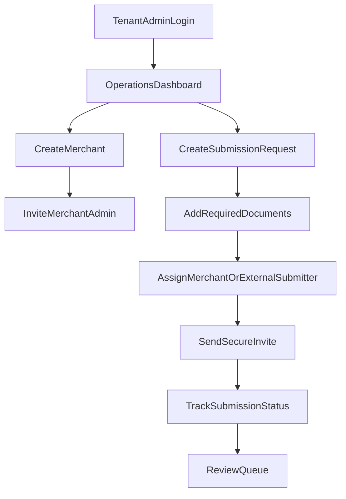
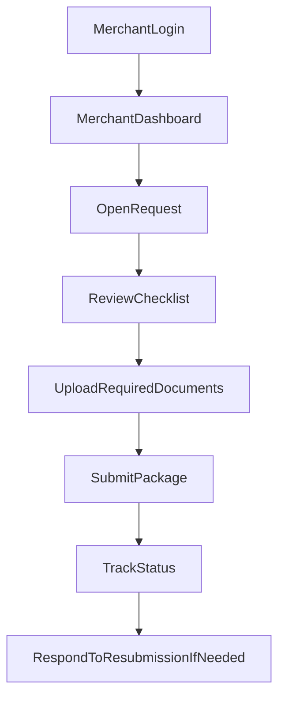
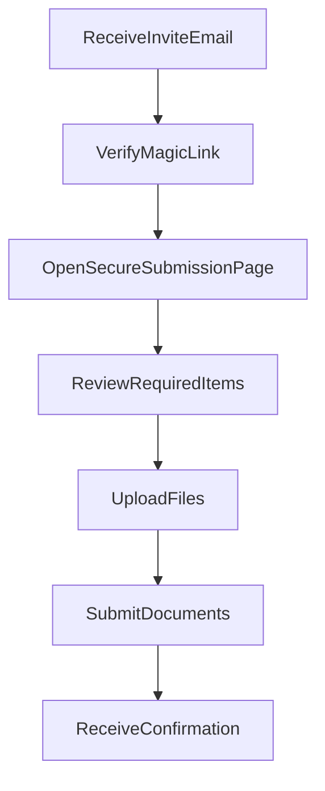
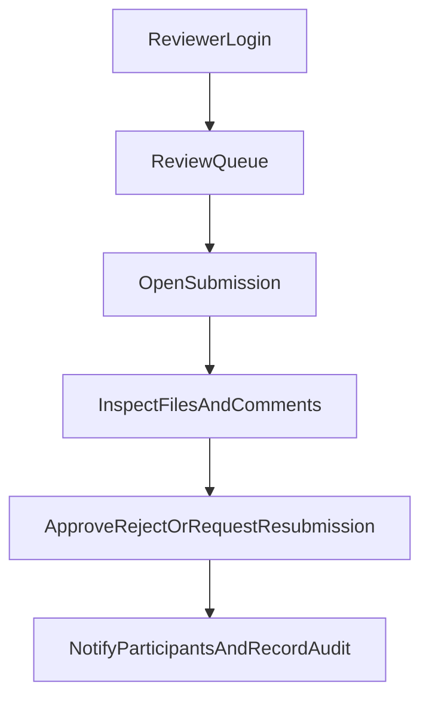

# Trade Finance KYC Platform - Wireframes and User Journeys

**Version:** 1.0  
**Date:** July 2026

---

## 1. Purpose

This document gives low-fidelity wireframes and core user journeys for the MVP. It is meant to guide product design, engineering breakdown, and Jira story creation.

The MVP includes three core experiences:
- tenant operations portal
- merchant portal
- external submitter portal

---

## 2. UX Principles

The product should feel:
- secure
- fast
- simple
- explicit about next actions

Key design principles:
- one primary action per page
- clear submission progress
- minimal cognitive load for external submitters
- visible trust cues around security and file handling
- strong reviewer visibility into pending actions

---

## 3. Tenant Admin Journey

### 3.1 Goal

Create merchants, create document requests, monitor submissions, and manage reviewers.

### 3.2 Journey



### 3.3 Wireframe - Operations Dashboard

```text
+----------------------------------------------------------------------------------+
| Logo | Tenant Name                                  Alerts | User Menu           |
+----------------------------------------------------------------------------------+
| Sidebar                                                                         |
| - Dashboard                                                                     |
| - Merchants                                                                     |
| - Requests                                                                      |
| - Review Queue                                                                  |
| - Audit Log                                                                     |
| - Settings                                                                      |
+--------------------------------------+-------------------------------------------+
| KPI Cards                            | Pending Review                            |
| - Pending submissions                | [REQ-102] ABC Traders                     |
| - Needs resubmission                 | [REQ-103] Delta Imports                   |
| - Approved this week                 | [REQ-104] KYC refresh                     |
| - Rejected this week                 |                                           |
+--------------------------------------+-------------------------------------------+
| Recent Requests                                                                  |
| Ref | Merchant | Type | Status | Last Updated | Action                          |
+----------------------------------------------------------------------------------+
```

### 3.4 Wireframe - Create Request

```text
+----------------------------------------------------------------------------------+
| Create Submission Request                                                        |
+----------------------------------------------------------------------------------+
| Merchant: [Select Merchant____________________]                                  |
| Request Type: [KYC Onboarding v] [Trade Transaction v]                          |
| Counterparty: [Optional_______________________]                                  |
| Reference: [Auto / Manual____________________]                                   |
| Due Date: [_____________]                                                        |
|                                                                                  |
| Required Documents                                                               |
| [ ] Certificate of Incorporation                                                 |
| [ ] Tax Certificate                                                              |
| [ ] Bank Statements                                                              |
| [ ] Proforma Invoice                                                             |
| [ ] Letter of Credit                                                             |
| [+ Add Custom Document]                                                          |
|                                                                                  |
| Participants                                                                     |
| Merchant User: [Select____________________]                                      |
| External Submitter Email: [Optional____________________]                         |
|                                                                                  |
| [Save Draft] [Send Request]                                                      |
+----------------------------------------------------------------------------------+
```

---

## 4. Merchant Journey

### 4.1 Goal

Receive requests, upload documents, track status, and respond to reviewer feedback.

### 4.2 Journey



### 4.3 Wireframe - Merchant Dashboard

```text
+----------------------------------------------------------------------------------+
| Logo | Merchant Portal                                  Notifications | Profile   |
+----------------------------------------------------------------------------------+
| Requests                                                                         |
|----------------------------------------------------------------------------------|
| Ref       | Type              | Status             | Due Date   | Action         |
| REQ-102   | KYC Onboarding    | In Progress        | 12 Jul     | Continue       |
| REQ-099   | Trade Transaction | Needs Resubmission | 10 Jul     | View Feedback  |
| REQ-087   | KYC Refresh       | Approved           | -          | View Receipt   |
+----------------------------------------------------------------------------------+
```

### 4.4 Wireframe - Request Detail

```text
+----------------------------------------------------------------------------------+
| Request REQ-102                                          Status: In Progress     |
+----------------------------------------------------------------------------------+
| Progress: [########------] 4 of 6 documents uploaded                             |
|                                                                                  |
| Required Documents                                                               |
| 1. Certificate of Incorporation     [Uploaded]      [Replace]                    |
| 2. Tax Certificate                  [Upload]                                      |
| 3. Bank Statements                  [Uploaded]      [Replace]                    |
| 4. Proforma Invoice                 [Upload]                                      |
| 5. Letter of Credit                 [Optional]    [Upload]                       |
| 6. Beneficial Ownership Form        [Uploaded]                                    |
|                                                                                  |
| Notes from Reviewer                                                              |
| - None yet                                                                       |
|                                                                                  |
| [Save Progress] [Submit for Review]                                              |
+----------------------------------------------------------------------------------+
```

---

## 5. External Submitter Journey

### 5.1 Goal

Complete a narrow, secure upload flow for a specific request without navigating the full platform.

### 5.2 Journey



### 5.3 Wireframe - External Submission Page

```text
+----------------------------------------------------------------------------------+
| Secure Document Request                                                          |
+----------------------------------------------------------------------------------+
| Company: ABC Traders                                                             |
| Request: Trade Transaction Support                                               |
| Security Notice: Your files are uploaded securely and visible only to            |
| authorized reviewers for this request.                                           |
|                                                                                  |
| Required Items                                                                   |
| - Proforma Invoice                     [Upload]                                  |
| - Supplier Registration Certificate    [Upload]                                  |
| - Signed Contract                      [Upload]                                  |
|                                                                                  |
| Need help? Contact the merchant or finance team.                                 |
|                                                                                  |
| [Save and Return Later] [Submit Documents]                                       |
+----------------------------------------------------------------------------------+
```

### 5.4 Wireframe - Submission Confirmation

```text
+----------------------------------------------------------------------------------+
| Submission Received                                                              |
+----------------------------------------------------------------------------------+
| Thank you. Your documents have been submitted successfully.                      |
| Reference: REQ-102                                                               |
| Submitted At: 09 Jul 2026 13:22 EAT                                              |
|                                                                                  |
| The finance team will review the documents and notify the relevant parties.      |
|                                                                                  |
| [Close]                                                                          |
+----------------------------------------------------------------------------------+
```

---

## 6. Reviewer Journey

### 6.1 Goal

Review queued submissions quickly and issue a clear outcome.

### 6.2 Journey



### 6.3 Wireframe - Review Queue

```text
+----------------------------------------------------------------------------------+
| Review Queue                                                                     |
+----------------------------------------------------------------------------------+
| Filters: [Pending v] [Merchant v] [Age v] [Search____________]                   |
|----------------------------------------------------------------------------------|
| Ref     | Merchant      | Type               | Submitted At | Age | Action       |
| REQ-102 | ABC Traders   | Trade Transaction  | 09 Jul       | 2h  | Review       |
| REQ-103 | Delta Imports | KYC Onboarding     | 09 Jul       | 5h  | Review       |
+----------------------------------------------------------------------------------+
```

### 6.4 Wireframe - Review Screen

```text
+----------------------------------------------------------------------------------+
| REQ-102 | ABC Traders                                  Status: Pending Review    |
+----------------------------------------------------------------------------------+
| Left Panel                           | Right Panel                                |
|--------------------------------------|--------------------------------------------|
| Checklist                            | Selected Document Preview                  |
| - Certificate [Ready]                | File Name                                  |
| - Tax Cert [Ready]                   | Preview / Download                         |
| - Proforma [Ready]                   | Metadata / Scan Status                     |
| - LC [Missing]                       |                                            |
|                                      | Reviewer Comments                          |
| Submission History                   | [Type comment___________________________]  |
| - Submitted 11:22                    | [Add Comment]                              |
| - Scan complete 11:28                |                                            |
|                                      | Actions                                    |
|                                      | [Approve] [Reject] [Request Resubmission]  |
+----------------------------------------------------------------------------------+
```

---

## 7. Critical UX Requirements

The following requirements should be preserved through design and build:
- all upload states must be visible
- missing required items must be obvious
- reviewer feedback must be tied to the exact request or file
- external submitter flow must work well on mobile web
- the system should always show what happens next after an action

---

## 8. Design Handoff Notes

When moving from wireframes into visual design:
- keep page density moderate for operations users
- prioritize clear tables and filters for reviewer workflows
- use strong trust language around secure uploads
- support simple responsive layouts for merchant and external flows
- keep the external submission experience brandable per tenant in later phases
